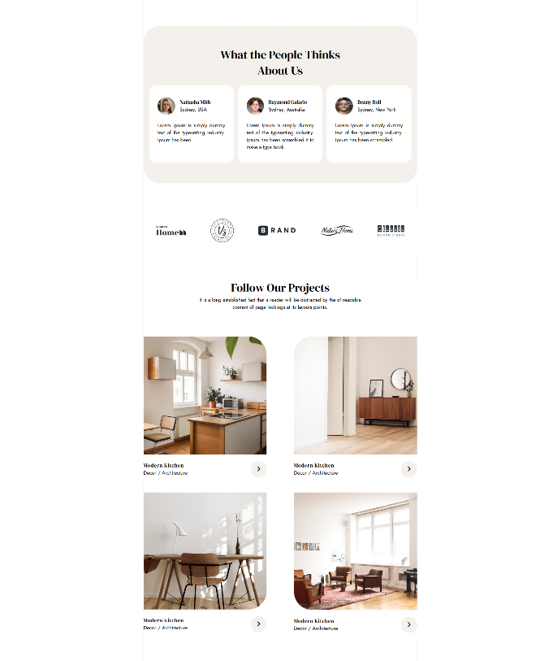

(點擊題目說明查看成果)

## [1. 練習使用background與position，利用 mario素材 完成以下畫面：](https://sugarban-p.github.io/css3-practice/hw1/hw1_body-ver.html)

  

 

## [2. 使用flex完成以下排版樣式：](https://sugarban-p.github.io/css3-practice/hw2/hw2.html)

  

 

## [3. 使用flex完成以下主導覽排版：](https://sugarban-p.github.io/css3-practice/hw3/hw3.html)

### 電腦版

  

### 手機版

  

 

## [4. 使用flex完成以下排版(電腦版)：](https://sugarban-p.github.io/css3-practice/hw4/hw4.html)

  

